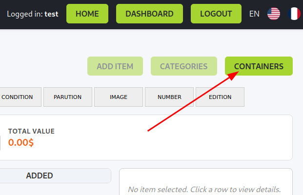
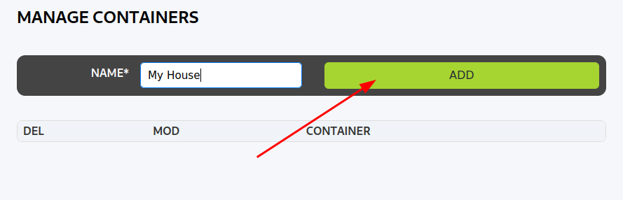
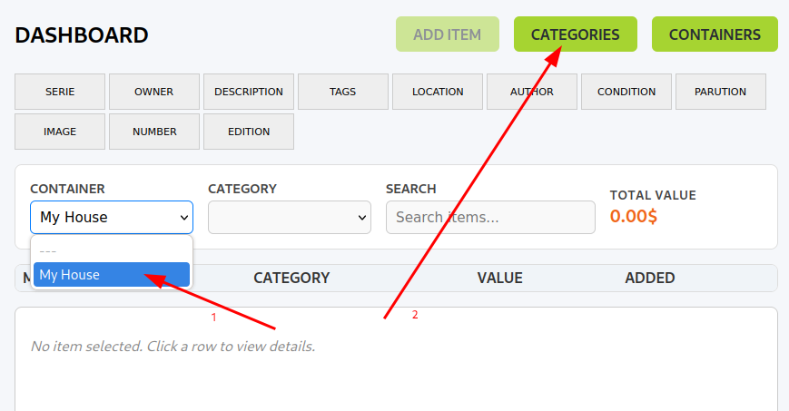
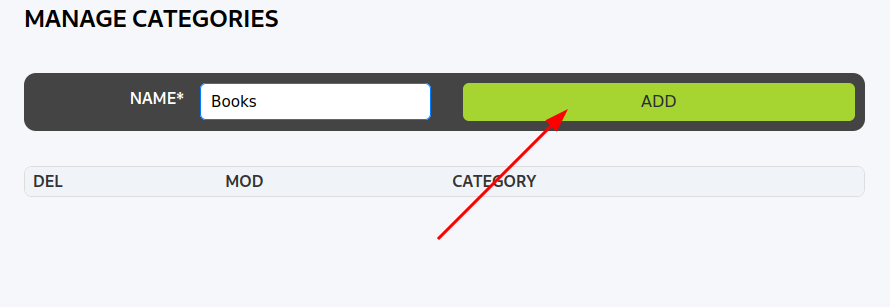
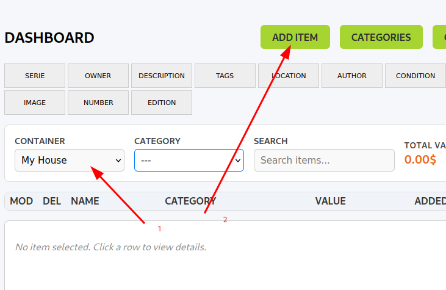
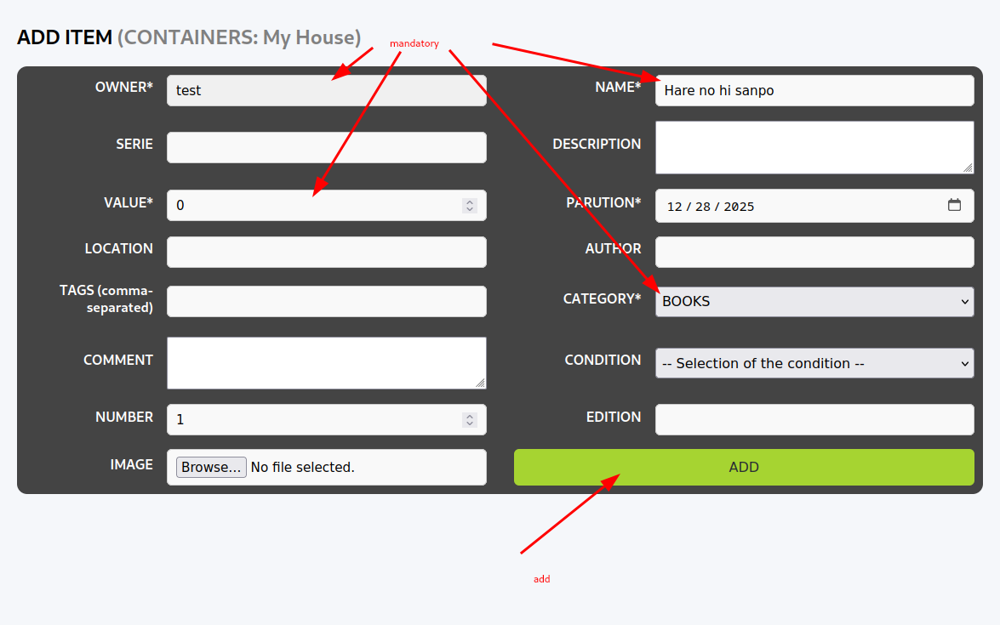
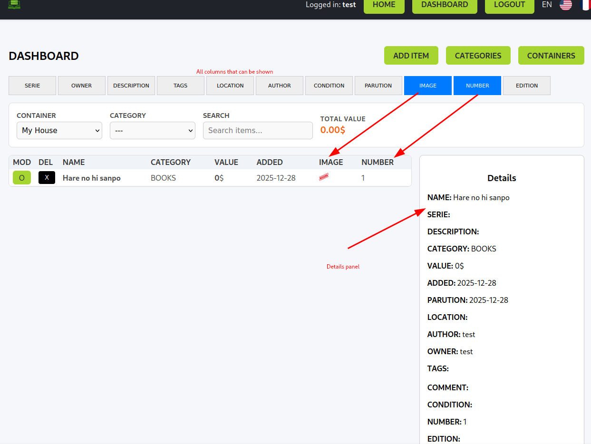

# LibStock - Personal Inventory Management System

[](https://opensource.org/licenses/MIT)
[](https://www.python.org/downloads/)
[](https://reactjs.org/)

> A powerful and flexible personal inventory management system for organizing your collections, items, and belongings.

---

# Table of Contents

- [Overview](#overview)
- [Features](#features)
- [Getting Started](#getting-started)
- [User Guide](#user-guide)
- [API Documentation](#api-documentation)
- [Data Structure](#data-structure)
- [Security](#security)
- [Troubleshooting](#troubleshooting)
- [Contributing](#contributing)
- [License](#license)

---

# Overview

**LibStock** is a containerized inventory management system that allows you to organize and track your personal items in a hierarchical structure. Whether you're managing a video game collection, tools, books, or any other items, LibStock provides a flexible and intuitive way to catalog and retrieve your belongings.

## How It Works

LibStock uses a three-tier organizational structure:

```
Containers
    └── Categories
            └── Items
```

1. Containers: Top-level organizational units (e.g. "My House")
2. Categories: Subdivisions within containers (e.g. "Video Games", "Books")
3. Items: Individual objects you want to track (e.g. "Die Hard 3 - Retour en Enfer")

---

# Features

## Core Functionality
- Multiple Containers: Create unlimited containers for different collections
- Custom Categories: Organize items with flexible categorization
- Rich Item Details: Track name, description, value, condition, location, and more
- Image Upload: Attach photos to your items
- Smart Filtering: Filter items by category
- Tags System: Add multiple tags per item for easy searching
- Value Tracking: Monitor the total value of your collections

## Security & Access
- User Authentication
- Multi-user Support
- Permission Control
- Rate Limiting

## Technical Features
- RESTful API: Well-documented API endpoints
- Responsive Design: Works on desktop and mobile
- CORS Support: Cross-origin resource sharing enabled
- Data Export: Export your inventory data

---

# Getting Started

## Prerequisites

- Python 3.11 or higher
- Node.js 18 or higher
- MongoDB 6.0 or higher

## Installation
- Clone the repository
```bash
git clone https://github.com/PpairNode/LibStock.git
cd LibStock
```

### Docker
See [Docker Build](docs/BUILD.md)

### Manual
- Backend Setup
```bash
cd backend
python -m venv .venv
source .venv/bin/activate  # On Windows: .venv\Scripts\activate
pip install -r requirements.txt
```

- Create `.env` file
```bash
APP_SECRET_KEY=your-secret-key-here
MONGO_URI=mongodb://localhost:27017/
MONGO_DB_NAME=libstock
REACT_HOST_ORIGIN=http://localhost:3000
FLASK_ENV=development
```

- Frontend Setup
```bash
cd ../frontend
npm install
```

- Run the Application
```bash
# Backend
cd backend
python run.py

cd frontend
npm start
# 
```

### Access the Application
- Frontend: `http://localhost:3000`
- API: `http://localhost:8000/api`
- API Docs: `http://localhost:8000/docs`

---

# User Guide

## Creating The First Container
Steps:
- Log in to your account
- Navigate to the Dashboard
- Click "CONTAINERS"



- Enter a container name (e.g., "My House")
- Click "CREATE"



**Important Notes:**
- Maximum 256 characters
- You can rename or delete containers later
- Deleting a container will delete all categories and items in it

---

## Adding Categories

Categories help organize items within a container. **You must create at least one category before adding items.**

Steps:
- Select a container with the selector
- Click "CATEGORIES"



- Enter category name (e.g. BOOKS)
- Click "ADD"



**Important Notes:**
- Category names are automatically converted to UPPERCASE
- Maximum 256 characters
- You can rename or delete categories later
- Deleting a category will delete all items in that category

---

## Adding Items

Once you have a container and at least one category, you can add items. The "ADD ITEM" button must be enabled.

Steps:
- Select a container
- Click "ADD ITEM"



- Fill in item details:
    - **Name*** (required) - Item name
    - **Owner*** (required) - Who owns it
    - **Value*** (required) - Monetary value (Positive or Negative, depends on the use you do with this tool)
    - **Category*** (required) - Select from available categories
    - **Description** - Detailed description
    - **Serie** - Series or model
    - **Condition** - New, Very Good, Good, Used, Damaged, Heavily Damaged
    - **Location** - Where it's stored
    - **Edition** - Special edition info
    - **Number** - Quantity
    - **Date Created** - When item was acquired
    - **Tags** - Keywords for searching (up to 50 tags)
    - **Comment** - Additional notes
    - **Image** - Upload a photo
- Click "ADD"



**Field Limits:**
- Tags: 50 tags max, comma-separated list
- Image: 16MB max (PNG, JPG, JPEG, GIF)

---

## Managing Your Inventory



### Viewing Items
- All items in a container are displayed in a table format
- Filter by category using the dropdown menu
- View item details by clicking on an item

### Editing Items
- Click on an "O" on the side of an item
- Modify fields
- Click "EDIT"

### Deleting Items
- Click on an "X" on the side of an item
- Associated image will be automatically deleted

---

**Supported Formats:**
- PNG
- JPG/JPEG

## Filtering and Searching

### Category Filter
- Use the dropdown menu to filter items by category
- "---" shows all items in the container (not category filtered)

### Custom Columns
- Toggle which columns to display in the table view
- Preferences are saved in your browser

### Search
In the search bar, searched columns are:
- Name
- Creator
- Owner
- Description
- Comment
- Edition
- Author
- Condition
- Location
- Serie

---

# Contributing

In the case of a bug or vulnerability, we welcome feedback (github issues)!
Also if they are some feature that you would want to be implemented, don't hesitate.

# License

This project is licensed under the MIT License - see the [LICENSE](LICENSE) file for details.

